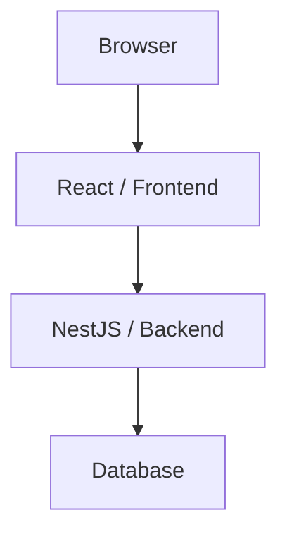

# システム構成図

## 1.技術スタック
- **Frontend**: React
- **Backend**: NestJS(Node.js), TypeORM
- **Database**: PostgreSQL

## 2.構成図

```mermaid

graph TD;
    A[Browser]-->B[React / Frontend];
    B-->C[NestJS / Backend];
    C-->D[Database];
```