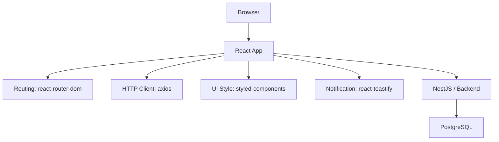

# システム構成図

## 1.技術スタック

- **Frontend**: React, TypeScript, react-router-dom, axios, styled-components, react-toastify
- **Backend**: NestJS(Node.js), TypeORM
- **Database**: PostgreSQL
- **Development/Quantity**: ESLint, Prettier, Jest

## 2.構成図

