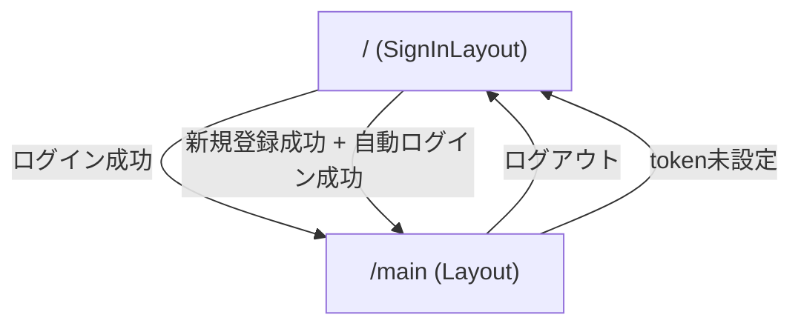

# 画面遷移図/UI設計

## 1. 画面一覧

### 1-1. サインイン/サインアップ画面 (`/`)

- 目的: ログインと新規登録
- 構成
  - `SignIn`（ログインフォーム）
  - `SignUp`（新規登録フォーム）
- 実装: `SignInLayout` で `SignIn` と `SignUp` を縦並び表示

### 1-2. メイン画面 (`/main`)

- 目的: 投稿作成と投稿一覧閲覧
- 認可要件: `UserContext.userInfo.token` が空文字でないこと
- 構成
  - `Header`（ロゴ、ユーザー名、ログアウト）
  - `SideBar`（新規投稿フォーム）
  - `Contents`（投稿一覧）

## 2. 画面遷移

## 3. ルーティング設計

- `App.tsx`
  - `path="/"` -> `SignIn`
  - `path="/main"` -> `Main`
- `Main.tsx`
  - `userInfo.token !== ""` の場合のみ `Layout` を表示
  - 未ログイン時は `Navigate replace to="/"`

## 4. UIコンポーネント設計

### 4-1. SignIn

- 入力項目
  - `ID`（実装上はユーザー名）
  - `Password`
- 操作
  - `Login` ボタン押下で `GET /auth`
  - 成功時に `UserContext` へ `id/token` 保存し `/main` へ遷移
- 表示
  - 失敗時はエラーメッセージ表示 + トースト表示
  - 送信中はボタン無効化

### 4-2. SignUp

- 入力項目
  - ユーザー名
  - メールアドレス
  - Password
- フロントバリデーション
  - 全項目必須
  - メール形式チェック
  - パスワード6文字以上
- 操作
  - `POST /user` で新規登録
  - 続けて `GET /auth` で自動ログイン
  - 成功時 `/main` へ遷移
- 表示
  - 失敗時はエラーメッセージ表示 + トースト表示
  - 送信中はボタン無効化

### 4-3. Header

- 表示
  - 左: `MicroPost` ロゴ
  - 右: `<ユーザー名>さん` と `ログアウト` ボタン
- 初期処理
  - `getUser(userInfo.id, userInfo.token)` で表示名取得
- ログアウト
  - `UserContext` を `{ id: 0, token: "" }` にリセット
  - `/` へ遷移

### 4-4. SideBar

- 入力項目
  - 投稿テキスト（`textarea`）
- ボタン制御
  - 以下いずれかで `送信` 無効化
    - 本文が空
    - 140文字超過
    - 投稿リクエスト中
- 操作
  - `POST /post?token=...` を実行
  - 成功時は入力クリア後、投稿一覧再取得

### 4-5. PostList / Post

- 初期表示時に投稿一覧取得 (`getPostList`)
- `更新` ボタンで再取得
- 読み込み中は `読込み中...` を表示
- 一覧項目表示
  - 投稿日時
  - 投稿者名
  - 投稿内容

## 5. 状態管理

### 5-1. UserContext (`UserProvider`)

- 共有状態: `userInfo`
  - `id: number`
  - `token: string`

### 5-2. PostListContext (`PostListProvider`)

- 共有状態
  - `postList: PostType[]`
  - `isloading: boolean`
- 共有処理
  - `getPostList()`

## 6. API連携ポイント

- `signIn(userId, pass)` -> `GET /auth?user_id=...&password=...`
- `createUser(name, email, password)` -> `POST /user`
- `getUser(id, token)` -> `GET /user/:id?token=...`
- `createPost(token, msg)` -> `POST /post?token=...`
- `getList(token)` -> `GET /post?records=20&token=...`

## 7. エラー表示方針

- APIエラーは `extractErrorMessage` で文字列化
- 画面表示
  - 一部コンポーネントではインライン表示（SignIn/SignUp）
  - 全体でトースト通知（`react-toastify`）を併用

## 8. レイアウト方針

- メイン画面は2カラム固定レイアウト
  - 左30%: 投稿入力
  - 右70%: 投稿一覧
- ヘッダー固定高さ: `32px`
- 投稿一覧は縦スクロール (`overflow-y: scroll`)

## 9. 今後の改善候補

- モバイル向けレスポンシブ対応（現在はPC向け固定比率）
- ルートガードの共通化
- エラーメッセージの文言統一
